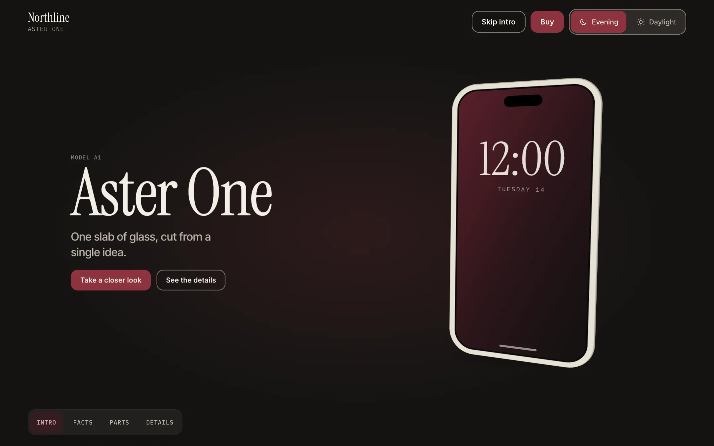
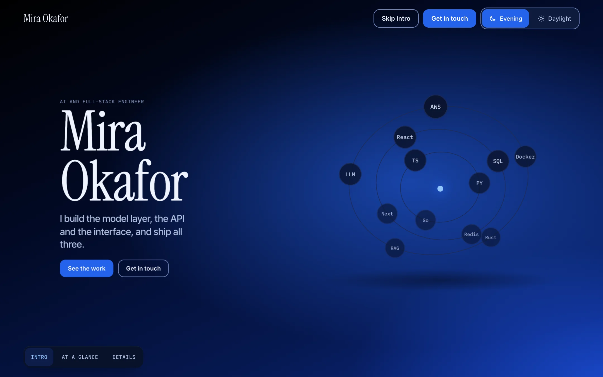
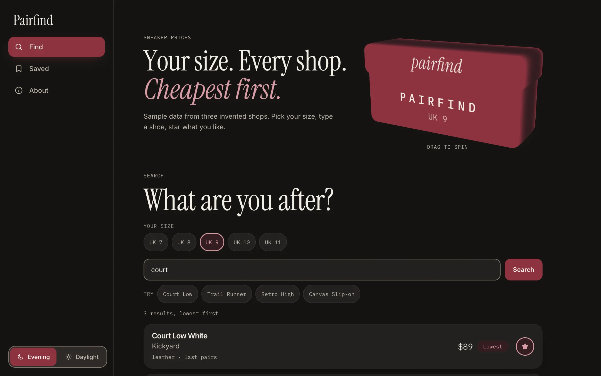
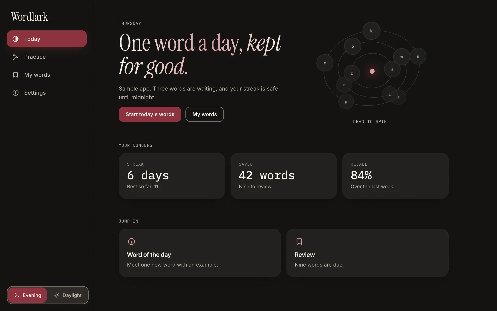

# swap_da_skill

**A Claude Code skill that builds websites as a stage, not a stacked page.**
It works out what kind of site you are making, then builds it from a matching example: a product page, a portfolio, a single-task tool or a daily app.

The skill inside is called `bhookmark-ui`. This repository is its home.

[](docs/media/swap_da_skill.mp4)

<sub>A 21.5 s tour of every feature. [Watch with sound (MP4)](docs/media/swap_da_skill.mp4). Every frame is a real screen from this repo's examples.</sub>

## What you get

| | |
| --- | --- |
| **It classifies first** | Product, portfolio, tool or app. Judged by who arrives and why, not by how the site looks. A site that looks like a shop can be a tool. |
| **A pinned 3D stage** | One viewport, scroll drives a timeline, content moves through depth. A tool or an app skips the stage on purpose. |
| **Focus and lock** | Click a part and the object turns to it and holds still with that part on screen. |
| **Depth cards** | Facts fly through the space beside the object at different depths. They pass by; they never orbit. |
| **Five hero-object backends** | `extrude` (outline rings), `frames` (WebP turntable), `glb` (three.js model), `orbit` (chips on rings), `shader` (raw WebGL orb). Pick one, or none. |
| **Themes are token files** | Burgundy Evening and Daylight ship as the Bhookmark identity; `midnight` is a black-and-blue skin. Swap the tokens and the whole page changes. |
| **A site kit** | One `window.SITE` manifest builds a sidebar shell (a bottom bar on phones) from blocks: hero, prose, specs, compare, faq, buy, timeline, work, flow, contact and more. |
| **Audit mode** | `audit.mjs` scans an existing project and prints a Before / After / Why table. It reports first and never edits. Brand rules live in a config so a company can swap them. |
| **Motion debug** | Slow-motion, pause and frame-step for any page, plus a linter for animations that touch layout or paint. |
| **Render habits** | Capped pixel density and reduced motion, measured rather than promised. See `references/render-habits.md`. |
| **Optional, only when you ask** | Animated flow diagrams (through [Archify](https://github.com/tt-a1i/archify), installed separately), animated headings, border beams, orbs. Never added to make a site look fuller. |

The floor never moves, whatever the theme: text at 4.5:1, control outlines at 3:1, 44px targets, focus always visible.

## The four kinds

| Product | Portfolio |
| --- | --- |
|  |  |
| **Tool** | **App** |
|  |  |

## Install

```bash
npx skills add NJ-0803/swap_da_skill
```

Or copy `skills/bhookmark-ui/` into `~/.claude/skills/`. The folder name must stay `bhookmark-ui`; it has to match the `name:` in `SKILL.md`.

Then just ask:

- "Make me a launch page for this product"
- "Build my portfolio"
- "A tool that compares sneaker prices, like a shop but it's one job"
- "Audit this project against the skill"
- "Slow the animation down, it feels janky"

## Try the examples

The examples are plain HTML. Serve the repo root and open them:

```bash
python3 -m http.server 8770
```

| Example | URL |
| --- | --- |
| Gallery (start here) | <http://localhost:8770/docs/> |
| Product, extruded object | `/skills/bhookmark-ui/assets/examples/aster-one/` |
| Product, WebP turntable | `/skills/bhookmark-ui/assets/examples/aster-frames/` |
| Product, GLB model | `/skills/bhookmark-ui/assets/examples/aster-glb/` |
| Portfolio | `/skills/bhookmark-ui/assets/examples/portfolio/` |
| Tool | `/skills/bhookmark-ui/assets/examples/tool/` |
| App | `/skills/bhookmark-ui/assets/examples/app/` |
| Shader hero | `/skills/bhookmark-ui/assets/examples/shader/` |
| Effects (optional) | `/skills/bhookmark-ui/assets/examples/effects-demo.html` |
| Diagrams (optional) | `/skills/bhookmark-ui/assets/examples/optional-diagrams/runtime-overview.html` |

Add `?motion-debug` to a page that loads `motion-debug.js` to open the slow-motion panel.

Run the audit on your own project:

```bash
node skills/bhookmark-ui/assets/audit.mjs path/to/your/project
```

## What is in the box

```
skills/bhookmark-ui/
  SKILL.md              the entry point: classify, then build
  references/           stage, site kit, archetypes, audit, motion debug, effects, render habits, diagrams
  assets/               stage engine, site kit, tokens and themes, object backends, audit, examples
docs/                   gallery page and media
```

## Honest status

- The examples use invented brands and sample data. Nothing in them is a real product.
- The audit is mechanical: colour, contrast, targets, motion properties and a few structural rules. Layout taste, hero discipline and copy still need a human or a model, and the report ends with that checklist so it is never mistaken for a full review.
- The GLB backend loads three.js from a CDN on demand and does not compress models. Self-host it if you need to. It pauses while the tab is hidden or the object is off screen, so a background tab or an automated screenshot of a hidden tab shows an empty stage.
- The frame and GLB examples ship generated assets (30 WebP frames, one 1.9 MB model) baked in the burgundy palette. For your own product, export your own.
- No server-side or pre-rendering yet: the stage is client-side.
- The burgundy palette and the no-gold rule are the Bhookmark identity. Another theme keeps the contrast floor, the 44px targets and the motion rules, and drops the rest.
- The diagram feature depends on a separately installed tool and is off unless you ask for it.

## License

[MIT](LICENSE). Third-party licenses and credits, including the music and sound effects in the video, are in [THIRD_PARTY_NOTICES.md](THIRD_PARTY_NOTICES.md).

Music in the video by [ende.app](https://ende.app/en) (CC BY 4.0).
